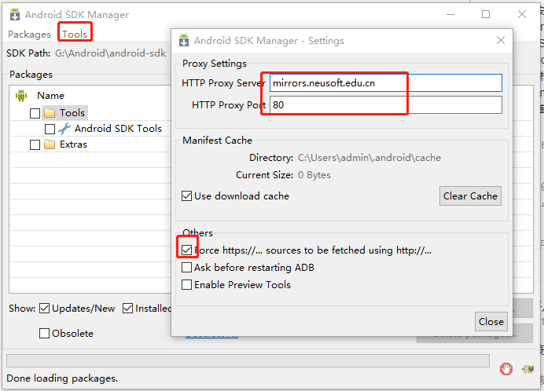
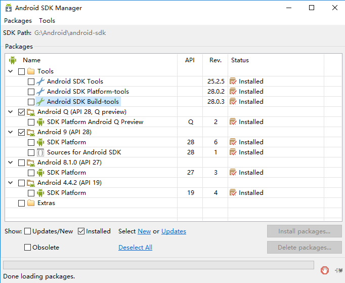

### Cordova
#### 环境配置概括：
* 安装nodejs,设置npm安装源
* 安装cordova
	* npm install - g cordova 安装完成后在命令行中执行 cordova -v 可以看到cordova的版本
* 安装java JDK1.8以上,设置java环境变量 (为支持android开发)
* 安装android sdk，设置android环境变量
* 安装安装gradle，设置gradle环境变量
	* 访问https://services.gradle.org/distributions/gradle-5.4-bin.zip，下载zip文件，解压到C:\Gradle\gradle-5.4，
	* 然后将C:\Gradle\gradle-5.4\bin加入到Path环境变量
	
#### 具体步骤：
1. npm install -g cordova  通过npm全局安装cordova
2. cordova -v   测试是否安装成功
3. cordova create CordovaProject io.cordova.hellocordova CordovaApp
	* CordovaProject 项目文件夹名。
	* io.cordova.hellocordova 是默认的项目包名，可以自定义。
	* CordovaApp 项目名。
4. cordova platform add android  安装支持安卓平台
5. 下载并安装android sdk 下载地址：https://blog.csdn.net/zanfeng/article/details/51866309  百度云盘android文件夹中有
 * 下载后直接下一步安装即可
 * 新建系统变量，变量名：ANDROID_HOME 变量值：自己本机的 Android SDK 路径 `G:\Android\android-sdk`
 *设置 sdk 的 tools 和 platform-tools 路径到 path 里，在 path 中加入 ;%ANDROID_HOME%\tools;%ANDROID_HOME%\platform-tools;
 * 在cmd命令窗口输入 android -h验证环境变量是否配置成功
 * 进入安装sdk的目录，运行SDK Manager 安装工具,设置下载包的源的代理。注意公司网络翻墙了也搜不出可以安装的包，需要用手机网络。
 * 在android sdk 安装目录下，有一个SDK Manager.exe，SDK Manager就是一个Android软件开发工具包管理器，就像一个桥梁，连通本地和服务器，从服务器下载安卓开发所需工具到本地。
 * 需要安装的插件请查看：https://www.cnblogs.com/guo2733/p/10558401.html
 * 附上亲测成功的需要安装的包 
6. cordova build android  构建应用程序
6. cordova emulate android  运行我们的应用程序。 如果你使用默认模拟器
7. cordova run android  运行我们的应用程序。如果想使用外部模拟器或真实设备
8. cordova requirements   验证jdk  sdk是否配置正确

#### 教程
//官方教程
https://www.w3cschool.cn/cordova/
// 配置cordova安卓开发环境
https://www.cnblogs.com/bingzhu/p/10204865.html
打包详解
https://www.cnblogs.com/qirui/p/8421372.html

### 混合app思路：
* 前端框架vue：一套框架，多个模块，有公共组件，一个模块出一个包(单独的项目)，代码之间互不影响。
* 入口分为2种，一为为内容较少的入口，页面做在该模块内的，通过路由跳转。另一种内容比较多的入口，新建模块，通过a标签跳转项目。
* 模块: 
	* 主模块(首页，作为其他模块的入口)
	* 分模块(大模块、例如:旅居地产、房事头条)
	* 模块之间通过cookies做单点登录，通过地址栏传参数
